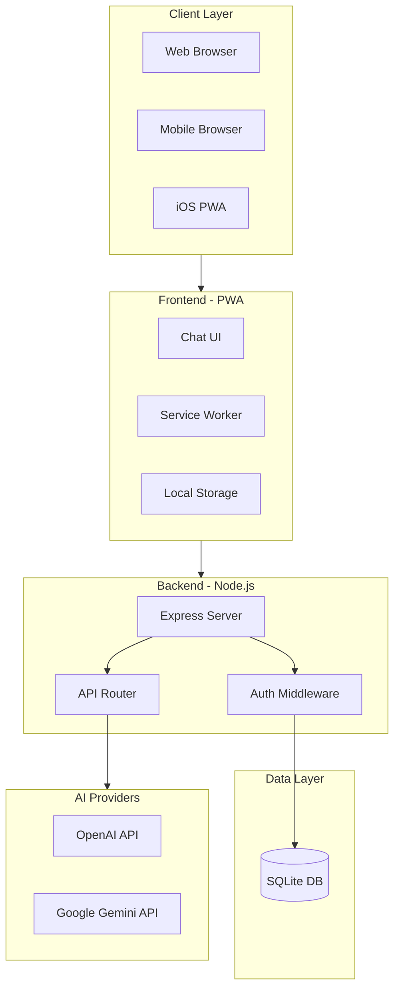
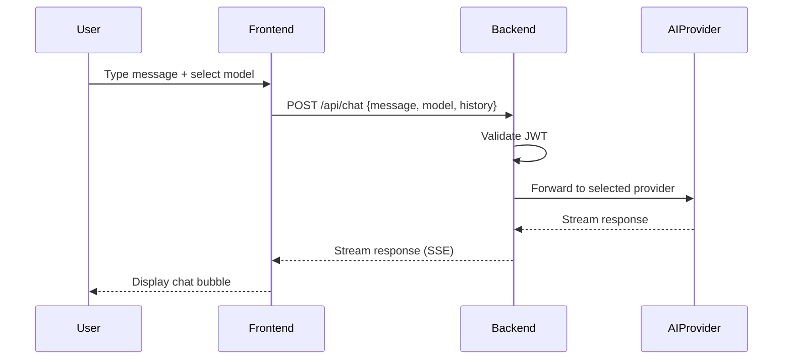

# AI Chat Wrapper Development Plan (Archived)

> Status: Historical snapshot from early v1 planning.
> This file intentionally preserves old assumptions (multi-model, invite-code-first flow, SQLite-era notes) and is **not** the current implementation spec.
> For current behavior, use `README.md`, `docs/task_plan.md`, and `docs/feature_list.json`.

## Overview

Build a Node.js-based AI chat wrapper with a responsive PWA frontend that allows verified users (via single-use invite codes) to chat with multiple AI models (ChatGPT 5.2, Gemini 3.1) and switch between them mid-conversation.

## Architecture Overview



## Tech Stack

| Layer | Technology |
|-------|------------|
| Frontend | Vanilla JS + HTML/CSS (lightweight, fast PWA) |
| Backend | Node.js + Express.js |
| Database | SQLite (simple, file-based, no setup) |
| AI SDKs | `openai`, `@google/generative-ai` |
| Auth | JWT tokens + bcrypt for invite code validation |

## Project Structure

```
ask_qiao/
├── server/
│   ├── index.js              # Express server entry
│   ├── config.js             # Environment config
│   ├── routes/
│   │   ├── auth.js           # Login/verify invite code
│   │   └── chat.js           # Chat API endpoints
│   ├── middleware/
│   │   └── auth.js           # JWT verification
│   ├── services/
│   │   ├── openai.js         # ChatGPT integration
│   │   └── gemini.js         # Gemini integration
│   ├── db/
│   │   ├── init.js           # SQLite setup
│   │   └── database.sqlite   # SQLite file (gitignored)
│   └── utils/
│       └── inviteCode.js     # Code generation utility
├── public/
│   ├── index.html            # Main chat interface
│   ├── login.html            # Invite code entry page
│   ├── manifest.json         # PWA manifest
│   ├── sw.js                 # Service worker
│   ├── css/
│   │   └── style.css         # Chat bubble styles
│   └── js/
│       ├── app.js            # Main chat logic
│       ├── api.js            # API client
│       └── auth.js           # Auth handling
├── scripts/
│   └── generate-invite.js    # CLI to generate invite codes
├── package.json
├── .env.example
└── README.md
```

## Database Schema (SQLite)

```sql
-- Users table
CREATE TABLE users (
    id INTEGER PRIMARY KEY AUTOINCREMENT,
    username TEXT UNIQUE NOT NULL,
    created_at DATETIME DEFAULT CURRENT_TIMESTAMP
);

-- Invite codes table
CREATE TABLE invite_codes (
    id INTEGER PRIMARY KEY AUTOINCREMENT,
    code TEXT UNIQUE NOT NULL,
    used_by INTEGER REFERENCES users(id),
    used_at DATETIME,
    created_at DATETIME DEFAULT CURRENT_TIMESTAMP
);
```

## API Endpoints

| Method | Endpoint | Description |
|--------|----------|-------------|
| POST | `/api/auth/verify` | Verify invite code, create user, return JWT |
| GET | `/api/auth/me` | Get current user info |
| POST | `/api/chat` | Send message to selected AI model |
| GET | `/api/models` | List available AI models |

## Chat API Flow



## Key Implementation Details

### 1. Invite Code System
- Generate secure random codes (e.g., `ABC123-XYZ789`)
- CLI script to create codes: `node scripts/generate-invite.js`
- Single-use: mark as used after verification

### 2. Chat Interface
- Clean, modern chat bubble UI (user right, AI left)
- Model selector dropdown above input
- Message shows which model responded
- Streaming responses for better UX
- Local storage for session chat history (ephemeral)

### 3. PWA Features
- `manifest.json` for "Add to Home Screen"
- Service worker for offline shell caching
- Responsive design (mobile-first)
- iOS status bar styling

### 4. AI Integration
- Unified interface for both providers
- Pass conversation history for context
- Handle streaming responses via Server-Sent Events (SSE)
- Error handling with user-friendly messages

## Environment Variables (.env)

```
PORT=3000
JWT_SECRET=your-jwt-secret
OPENAI_API_KEY=sk-...
GOOGLE_AI_API_KEY=AI...
```

## Development Phases

### Phase 1: Backend Foundation
- [ ] Set up Express server with SQLite
- [ ] Implement invite code generation and verification
- [ ] JWT authentication middleware

### Phase 2: AI Integration
- [ ] OpenAI (ChatGPT) service with streaming
- [ ] Google Gemini service with streaming
- [ ] Unified chat endpoint with model selection

### Phase 3: Frontend Chat UI
- [ ] Login page with invite code input
- [ ] Chat interface with bubbles
- [ ] Model selector and message input
- [ ] Streaming message display

### Phase 4: PWA Setup
- [ ] Service worker for caching
- [ ] Manifest for installability
- [ ] Mobile/iOS optimizations

### Phase 5: Polish and Security
- [x] Rate limiting
- [x] Input sanitization
- [x] Error handling
- [x] README documentation

### Phase 6: User Experience Enhancements
- [x] Prompt Builder (2026-01-07)
  - Structured prompt construction form
  - Required fields: PERSONA, TASK, CONTEXT
  - Optional fields: FORMAT, REFERENCES
  - Template based on `prompt.md`
